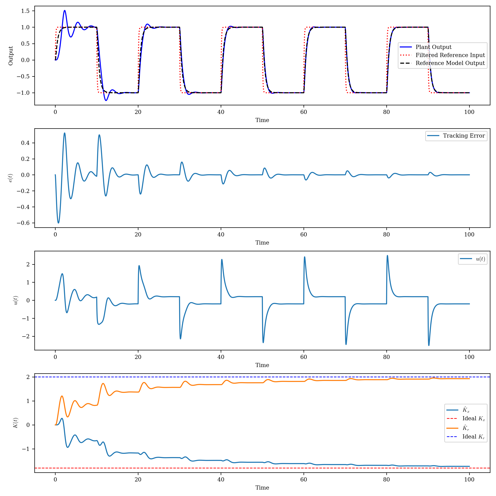

# Direct MRAC Simulation

This notebook demonstrates Direct Model Reference Adaptive Control (MRAC) for a SISO plant using Python.

## Plant and Reference Model

- **Plant:**
  \[
  \dot{x} = A x + B u
  \]
  \[
  y = C x + D u
  \]
  Where:
  - $A = -0.2$
  - $B = 1$
  - $C = 1$
  - $D = 0$

- **Reference Model:**
  \[
  \dot{x}_m = A_m x_m + B_m r
  \]
  \[
  y_m = C_m x_m + D_m r
  \]
  Where:
  - $A_m = -2$
  - $B_m = 2$
  - $C_m = 1$
  - $D_m = 0$

## Ideal Controller Parameters

\[
K_x = \frac{A_m - A}{B}
\]
\[
K_r = \frac{B_m}{B}
\]

## Adaptive Law (Direct MRAC)

The controller parameters $\hat{K}_x$ and $\hat{K}_r$ are updated using:
\[
\hat{K}_x \leftarrow \hat{K}_x - \Gamma e B x \Delta t
\]
\[
\hat{K}_r \leftarrow \hat{K}_r - \Gamma e B r \Delta t
\]

Where:
- $e = y - y_m$ (tracking error)
- $\Gamma$ is the adaptation gain

## Simulation

- The simulation uses a square wave reference input.
- The evolution of controller parameters, tracking error, and control input are plotted.

## Output

The notebook produces:
- Output comparison: plant, reference model, and ideal closed-loop
- Tracking error plot
- Control input plot
- Adaptive gain evolution plot

Example output plot:

## Requirements

- Python 3.x
- `controlsim`, `control`, `numpy`, `matplotlib`

---

For more details, see the notebook [MRAC_sim.ipynb](MRAC_sim.ipynb).
