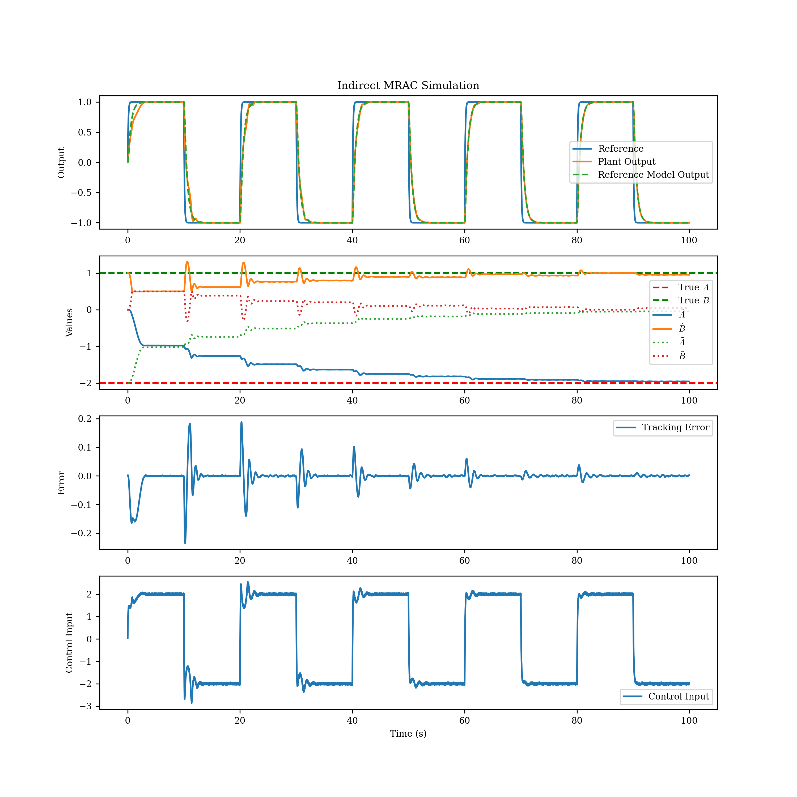

# Indirect MRAC Simulation

This project implements an Indirect Model Reference Adaptive Control (MRAC) simulation for a simple SISO plant using Python.

## Plant and Reference Model

- **Plant:**
  \[
  \dot{x} = A x + B u
  \]
  \[
  y = C x + D u
  \]
  Where:
  - $A = -2$
  - $B = 1$
  - $C = 1$
  - $D = 0$

- **Reference Model:**
  \[
  \dot{x}_m = A_m x_m + B_m r
  \]
  \[
  y_m = C_m x_m + D_m r
  \]
  Where:
  - $A_m = -2$
  - $B_m = 2$
  - $C_m = 1$
  - $D_m = 0$

## Ideal Controller Parameters

The ideal controller parameters are:
\[
K_x = \frac{A_m - A}{B}
\]
\[
K_r = \frac{B_m}{B}
\]

## Adaptive Law (Indirect MRAC)

The parameter estimates $\hat{A}$ and $\hat{B}$ are updated using:
\[
\hat{A} \leftarrow \hat{A} + \Gamma e y
\]
\[
\dot{\hat{B}} = \Gamma e u
\]

Where:
- $e = y - y_m$ (tracking error)
- $\Gamma$ is the adaptation gain

The controller gains are updated as:
\[
K_x = \frac{A_m - \hat{A}}{\hat{B}}
\]
\[
K_r = \frac{B_m}{\hat{B}}
\]

## Simulation

- The simulation uses a sinusoidal reference input.
- Noise is added to the control input.
- The evolution of parameter estimates, tracking error, and control input are plotted.

## Usage

Run the simulation script:

```bash
python IndirectMRAC_Sim.py
```

## Output

The script will display plots for:
- Reference and plant outputs
- Parameter estimates ($\hat{A}$, $\hat{B}$)
- Tracking error
- Control input

## Requirements

- Python 3.x
- `controlsim`, `control`, `numpy`, `matplotlib`

Install dependencies:

```bash
pip install -r requirements.txt
```

---


For more details, see the code in [IndirectMRAC_Sim.py](IndirectMRAC_Sim.py).

## Output Graphs and Results

The simulation produces the following plots:

1. **Reference, Plant Output, and Reference Model Output**
2. **Parameter Estimates ($\hat{A}$, $\hat{B}$) and Errors ($\tilde{A}$, $\tilde{B}$)**
3. **Tracking Error**
4. **Control Input**

Example (generated by the script):



At the end of the simulation, the script prints the final estimated parameters:

```

Final Estimated Ahat:  -1.96 and True A: -2.00
Final Estimated Bhat:  0.95 and True B: 1.00
```
---

## Exercise
- Try changing the adaptation gain $\Gamma$ and observe how it affects the convergence of parameter estimates and tracking error. What happens if $\Gamma$ is too high or too low?
- Experiment with the step size and noise level to see how they influence the system's performance.
- Derive and implement a different adaptive law for MIMO systems and compare the results with the SISO case.