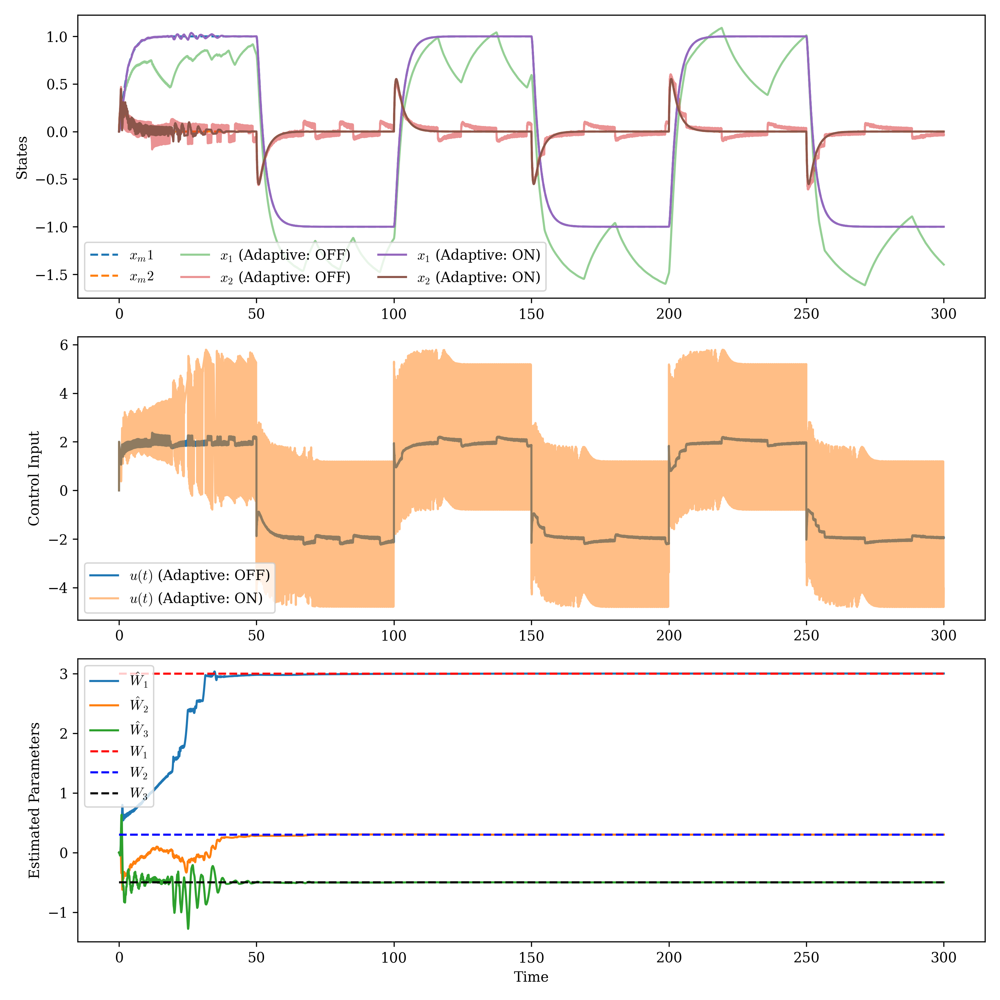

# Robust MRAC Python Simulation

This project implements a Robust Model Reference Adaptive Control (MRAC) system in Python for a second-order plant with uncertainties. The simulation demonstrates both nominal and adaptive control responses.

## Main File
- robustMrac.py: Contains the full simulation code, including plant/model definitions, uncertainty introduction, adaptive law, and plotting routines.

## Key Features
- Uses `controlsim` and `control` libraries for system modeling and simulation.
- Defines a plant and a reference model using state-space representations.
- Introduces uncertainties via a nonlinear function of state and time.
- Implements an adaptive law to estimate uncertain parameters.
- Compares system response with and without adaptation.
- Plots:
  - State trajectories (reference, adaptive ON/OFF)
  - Control input
  - Estimated parameters vs true values

## How to Run
1. Ensure required packages are installed:
   - controlsim
   - control
   - numpy
   - matplotlib
2. Run the script:
   ```bash
   python robustMrac.py
   ```
3. Output plots will be displayed and saved as `robust_mrac_response.png`.

## Main Functions
- `run_sumulation(gamma, sim_time)`: Runs the simulation for a given adaptation gain (`gamma`).
- `get_alpha(x, t)`: Computes the uncertainty basis functions.

## Parameters
- `gamma`: Adaptation gain (set to 0 for nominal, >0 for adaptive)
- `W`: True uncertainty parameters

## Output
- Plots of system states, control input, and parameter estimates
- Lyapunov matrix printed for stability analysis


## Mathematical Settings

### Uncertainty Basis Functions ($\alpha$)
The uncertainty in the plant is modeled using basis functions:

$$
\alpha(x, t) = \begin{bmatrix}
\sin(2 \cdot 10 \cdot x_1 \cdot t) \\
\cos(2 \cdot 15 \cdot x_2 \cdot t) \\
1
\end{bmatrix}
$$

where $x_1$ and $x_2$ are the plant states, and $t$ is time.

### Uncertainty Parameters ($W$)
The true uncertainty vector is:

$$
W = \begin{bmatrix} 3 & 0.3 & -0.5 \end{bmatrix}
$$

### Adaptive Law
The parameter estimation law is:

$$
\dot{\hat{W}} = \Gamma \cdot e^T P B \cdot \alpha(x, t)
$$

where:
- $\hat{W}$: Estimated parameters
- $\gamma$: Adaptation gain
- $e = x - x_m$: Tracking error (plant state minus reference model state)
- $P$: Lyapunov matrix (solution to $A^T P + P A = -Q$)
- $B$: Input matrix
- $\alpha(x, t)$: Uncertainty basis functions

The control input is:

$$
 u = K_r \cdot r + K_x \cdot x - \hat{W}^T \alpha(x, t)
$$

where $r$ is the reference input.

# Results
- The plots show that with adaptation (gamma > 0), the system states converge to the reference model states, while without adaptation (gamma = 0), there is a significant tracking error due to the uncertainties.
- The control input plot illustrates how the adaptive controller adjusts the input to compensate for the uncertainties.
- The parameter estimation plot shows how the estimated parameters converge towards the true values over time when adaptation is enabled.



## Exercises
1. Modify the uncertainty parameters $W$ and observe the system response.
2. Change the adaptation gain $\gamma$ and analyze its effect on convergence.
3. Implement a different reference model and compare responses.
4. Add noise to the system and evaluate robustness.
5. Try a standard basis function like radial basis functions (RBF) for $\alpha$ and compare results.

## Reference

- For theoretical background, see standard MRAC literature and course notes.

---
**Author:** Dr. Bharat Verma  
**Note:** Assistant Professor, The LNMIIT, Jaipur, India  
**ORCID:** [https://orcid.org/0000-0001-7600-7872](https://orcid.org/0000-0001-7600-7872)  
**GitHub:** [https://github.com/vkbharatv](https://github.com/vkbharatv)
